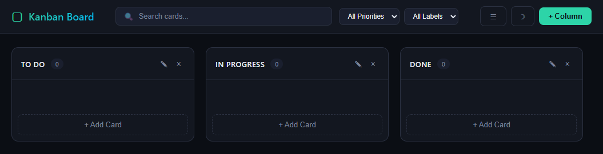

# Kanban Board

[](LICENSE)
[](https://python.org)
[](https://flask.palletsprojects.com)

A full-featured Kanban board web application with drag & drop, real-time statistics, and dark/light theme. Built with Flask, SQLite, and vanilla JavaScript — no frontend frameworks needed.



## Features

- **Drag & Drop** — Move cards between columns with smooth animations and visual feedback
- **Card Management** — Create, edit, and delete cards with title, description, labels, and priority
- **Due Dates** — Set deadlines with color-coded badges (green/orange/red for upcoming/soon/overdue)
- **Color Labels** — Assign colored labels (red, orange, green, blue, purple) for visual categorization
- **Priority Levels** — Tag cards as Low, Medium, or High priority
- **Search** — Instantly filter cards by title or description
- **Filters** — Filter by priority level or label color
- **Statistics Panel** — Slide-out sidebar with total cards, overdue count, per-column and per-priority breakdown
- **Dark / Light Mode** — Toggle between themes, preference saved in localStorage
- **Custom Columns** — Add, rename, or delete columns to fit your workflow
- **Responsive Design** — Works on desktop and tablet screens

## Tech Stack

| Technology | Purpose |
|---|---|
| Python 3.11+ | Backend |
| Flask | Web framework & REST API |
| SQLite | Local database |
| Vanilla JS | Frontend logic & drag/drop |
| CSS Custom Properties | Theming system |

## Installation & Setup

```bash
# Clone the repository
git clone https://github.com/FabioKurth/kanban-board.git
cd kanban-board

# Create virtual environment
python -m venv venv
source venv/bin/activate  # Linux/Mac
venv\Scripts\activate     # Windows

# Install dependencies
pip install -r requirements.txt

# Run the app
python app.py
```

The board will be available at `http://localhost:5000`.

## API Endpoints

| Method | Endpoint | Description |
|---|---|---|
| GET | `/api/columns` | Get all columns with cards |
| POST | `/api/columns` | Create a new column |
| PUT | `/api/columns/:id` | Rename a column |
| DELETE | `/api/columns/:id` | Delete column and its cards |
| POST | `/api/cards` | Create a new card |
| PUT | `/api/cards/:id` | Update a card |
| DELETE | `/api/cards/:id` | Delete a card |
| PUT | `/api/cards/move` | Move card to another column |
| GET | `/api/stats` | Get board statistics |

## Project Structure

```
kanban-board/
├── app.py                 # Flask app, API routes, database
├── templates/
│   └── index.html         # Single-page HTML template
├── static/
│   ├── css/
│   │   └── style.css      # Dark/light theme, layout, animations
│   └── js/
│       └── board.js       # Drag & drop, search, filters, stats
├── requirements.txt
├── .gitignore
├── LICENSE
└── README.md
```

## What I Learned

- **REST API design** — Building a clean CRUD API with Flask and proper HTTP methods
- **Drag & Drop API** — Native HTML5 drag and drop with custom placeholder positioning
- **CSS Custom Properties** — Using CSS variables for a dynamic theming system (dark/light)
- **Single Page Architecture** — Frontend that communicates with the backend entirely via fetch/JSON
- **SQLite with Foreign Keys** — Cascade deletes and relational data modeling
- **Responsive CSS** — Flexbox-based layout that adapts to different screen sizes

## License

This project is licensed under the MIT License — see the [LICENSE](LICENSE) file for details.
